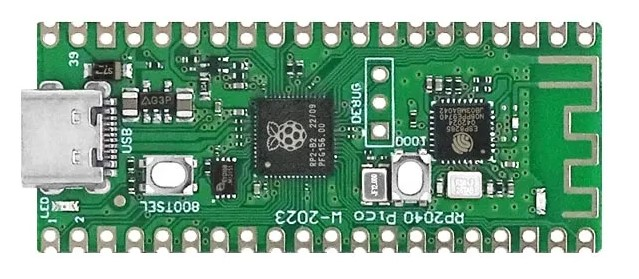

# Project

There is a Raspberry Pi Pico Board on the market called PICO-W that uses the ESP8285 wifi chip instead of the Infineon CYW43439. This is a problem because pre-built wifi libraries for PICO-W won't work.

# Goal
Create a library that works like the real Pico-W

# Project Status

